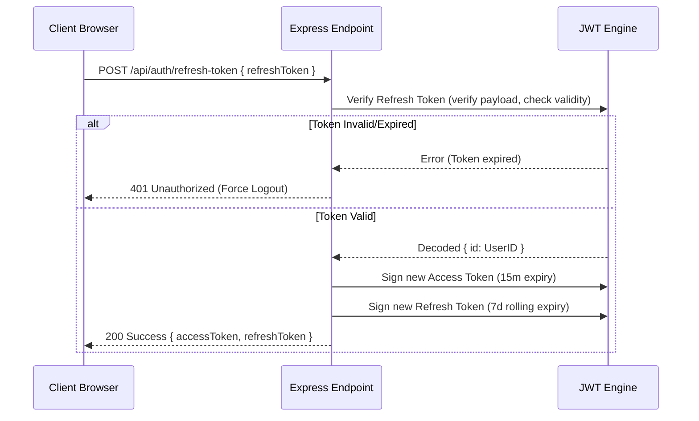
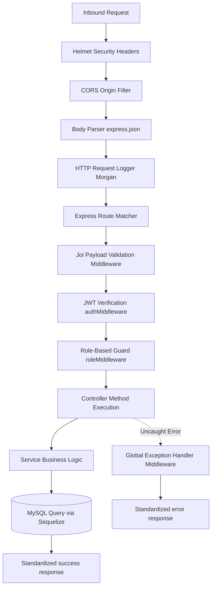

# Authentication Module Design & Verification

This document specifies the design, flow execution, security parameters, and middleware structures implemented for the Authentication Module.

---

## 1. Directory Structure

The following Authentication Module files have been successfully created and linked:

*   **Routes**: [auth.routes.js](file:///c:/Users/Admin/Desktop/staff%20attendence/backend/src/routes/auth.routes.js) (registers endpoints and validation/auth guards)
*   **Controller**: [auth.controller.js](file:///c:/Users/Admin/Desktop/staff%20attendence/backend/src/controllers/auth.controller.js) (maps endpoints parameters and invokes service logic)
*   **Service**: [auth.service.js](file:///c:/Users/Admin/Desktop/staff%20attendence/backend/src/services/auth.service.js) (handles user verification, password hashing, and token signing)
*   **Validator**: [auth.validation.js](file:///c:/Users/Admin/Desktop/staff%20attendence/backend/src/validations/auth.validation.js) (Joi schemas defining payload validations)
*   **Middlewares**:
    *   [auth.middleware.js](file:///c:/Users/Admin/Desktop/staff%20attendence/backend/src/middleware/auth.middleware.js) (JWT validation)
    *   [role.middleware.js](file:///c:/Users/Admin/Desktop/staff%20attendence/backend/src/middleware/role.middleware.js) (RBAC access restrictions)
    *   [validation.middleware.js](file:///c:/Users/Admin/Desktop/staff%20attendence/backend/src/middleware/validation.middleware.js) (Request validation wrapper)

---

## 2. API Contract Specification

| Method | Endpoint | Access | Request Body | Success Response | Description |
| :--- | :--- | :--- | :--- | :--- | :--- |
| **POST** | `/api/auth/login` | Public | Email, Password | Tokens + User Profile | Authenticates credentials and returns session tokens |
| **POST** | `/api/auth/refresh-token` | Public | Refresh Token | New Access + Refresh Token | Rotates expired access tokens using valid refresh tokens |
| **POST** | `/api/auth/logout` | Protected| None | Standard success message | invalidates current user sessions client-side |
| **GET** | `/api/auth/profile` | Protected| None | Profile info + Role details | Fetches complete user metadata |

---

## 3. JWT Flow & Token Rotation Strategy

To maintain maximum security and prevent session hijacking:

1.  **Access Token (Short-Lived)**:
    *   **Expiry**: `15 minutes` (default)
    *   **Payload**: `{ id: UserID, email: UserEmail, role: RoleName }`
    *   **Security**: Extracted from the `Authorization: Bearer <token>` header. It is stateless and parsed in memory.
2.  **Refresh Token (Long-Lived & Rolling)**:
    *   **Expiry**: `7 days` (default)
    *   **Payload**: `{ id: UserID }`
    *   **Strategy**: Rotates on every refresh request. When the client hits `/api/auth/refresh-token`, the service verifies the token, signs a *new* access token, signs a *new* refresh token, and returns both. This is known as **Refresh Token Rotation (RTR)**.



---

## 4. Request Lifecycle & Middleware Execution Order

Every request targeting a protected route moves through the pipeline in this strict execution sequence:



---

## 5. bcrypt Password Hashing Verification Flow

To secure stored passwords, we implement salted one-way hashing:

1.  **Rounds Parameter**: Set to `12` salt rounds (optimal balance of CPU difficulty and security parameters).
2.  **Creation Flow**:
    *   Administrator creates a profile -> calls model creator -> Sequelize triggers the `beforeCreate` lifecycle hook.
    *   `bcrypt.genSalt(12)` generates a unique salt string.
    *   `bcrypt.hash(password, salt)` hashes the plain-text password and replaces it in the active record before writing to the database table.
3.  **Verification Flow**:
    *   User inputs plain-text password -> controller extracts email -> finds user record in the database -> calls `User.comparePassword(enteredPassword)`.
    *   `bcrypt.compare(enteredPassword, hashedDbPassword)` extracts the salt parameters from the hashed password, hashes the entered password, and executes a constant-time check to compare hashes. This prevents timing attacks.

---

## 6. Response and Error Serialization

### Centralized Success Response
```json
{
  "success": true,
  "message": "Logged in successfully",
  "data": {
    "accessToken": "eyJhbGciOiJIUzI1NiIsInR5cCI6IkpXVCJ9...",
    "refreshToken": "eyJhbGciOiJIUzI1NiIsInR5cCI6IkpXVCJ9...",
    "user": {
      "id": 1,
      "email": "admin@company.com",
      "role": "ADMIN",
      "name": "Jane Doe"
    }
  }
}
```

### Centralized Exception Response
If credentials mismatch or inputs fail validation (status `400` / `401`):
```json
{
  "success": false,
  "message": "Request validation failed",
  "errors": [
    {
      "field": "email",
      "message": "Please specify a valid email address."
    }
  ]
}
```
In development mode, `error` (stack trace) is included in the JSON to simplify diagnostics.
